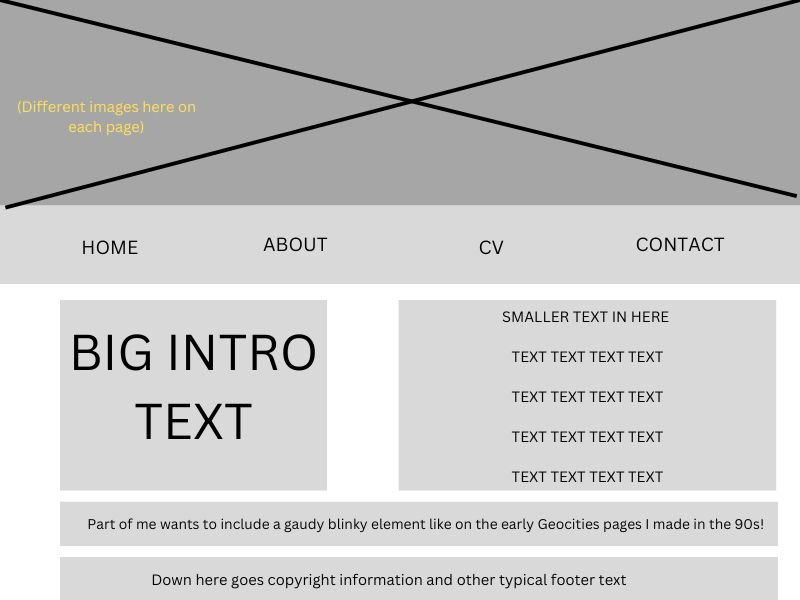
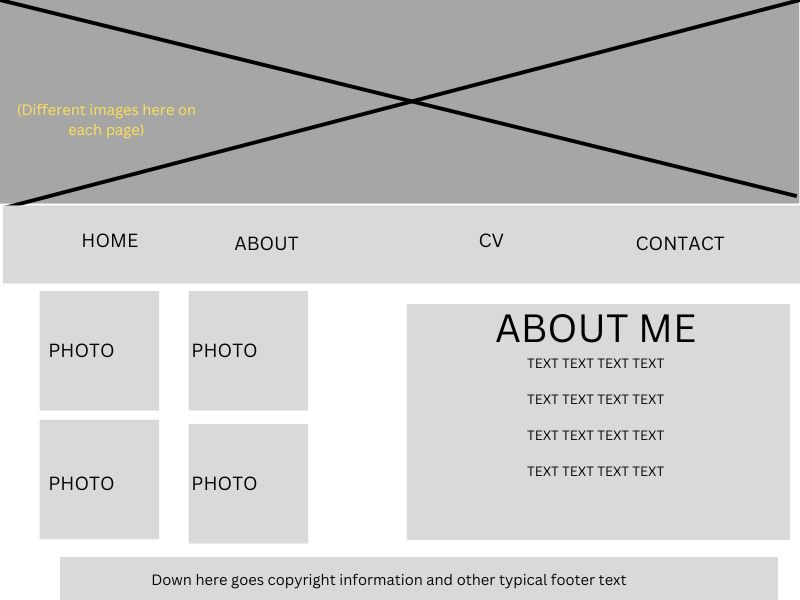
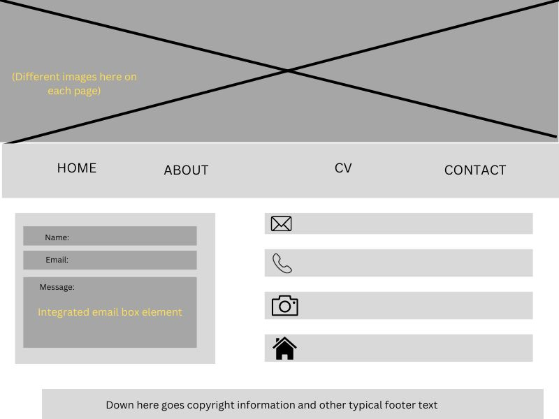

# Megan Novell's INF6420 Project

A basic website sharing information about me.

## Wireframes

I dropped out of art school, so creative design is not my strong skillset, but these are some ideas of how the page could be laid out.

Header - will include a large image with a navigation menu below

Navigation menu - will link to other pages on my site, like About and Contact

Main Content - will have some text with a welcome message and explanation of what the page is about

Footer - will include copyright information

Header - same size and ratio as other pages, but will use a different image

Navigation menu - this will be similar across pages, just with slight modifications to the links

Main content - this will have several smaller images arranged in a grid on the left side and then narrative text in a separate but equally sized box on the right

Footer - will include copyright information

Header - same proportions as the other pages, but yet another image

Navigation menu - beneath the big image, links to other pages on the site

Main content - on the left, an integrated box to send me an email directly from the page, and on the right, my phone, email, social media, and other contact information listed vertically and labeled with icons

Footer - same copyright information as other pages

